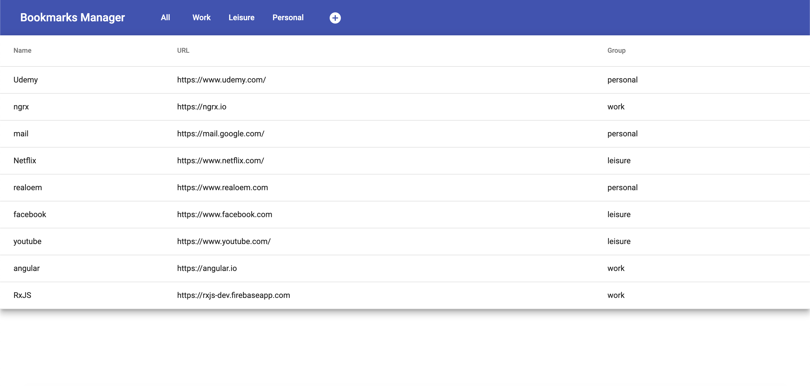
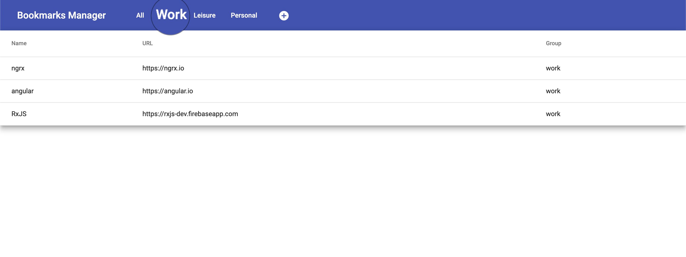
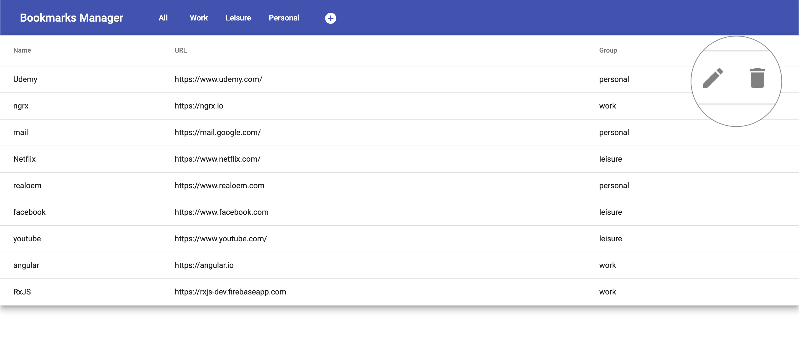
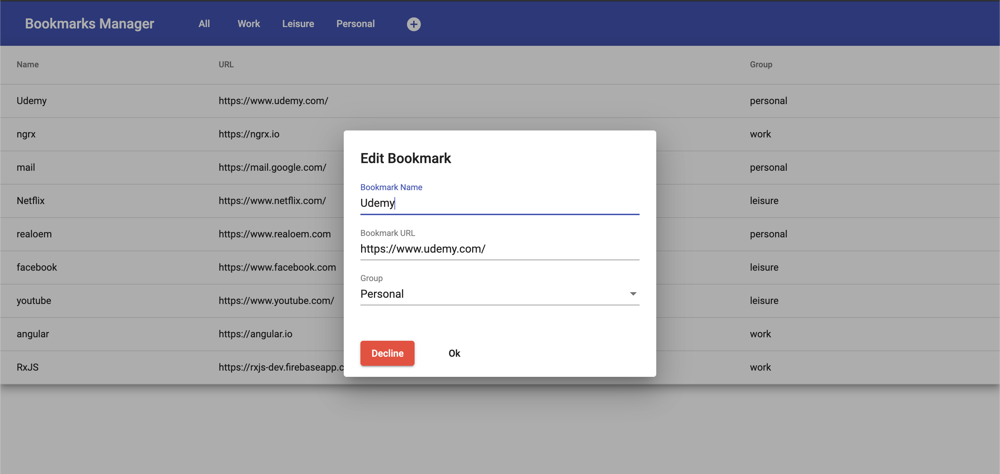
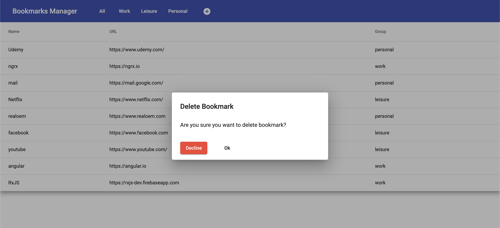
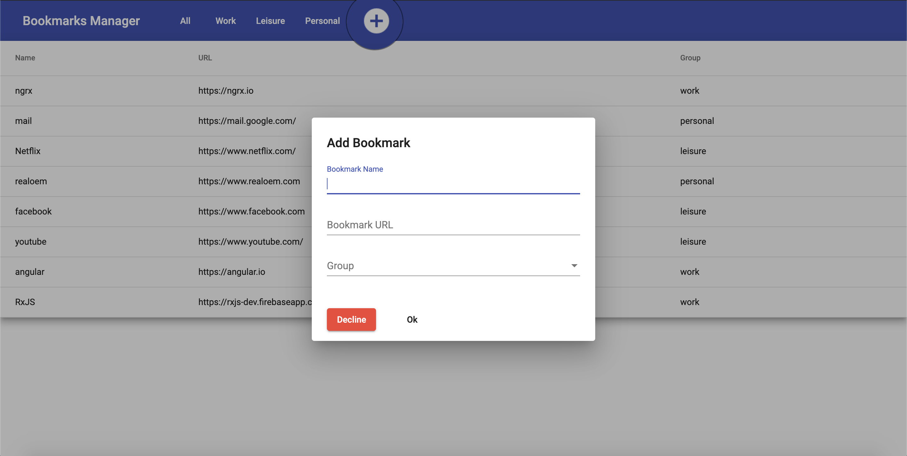
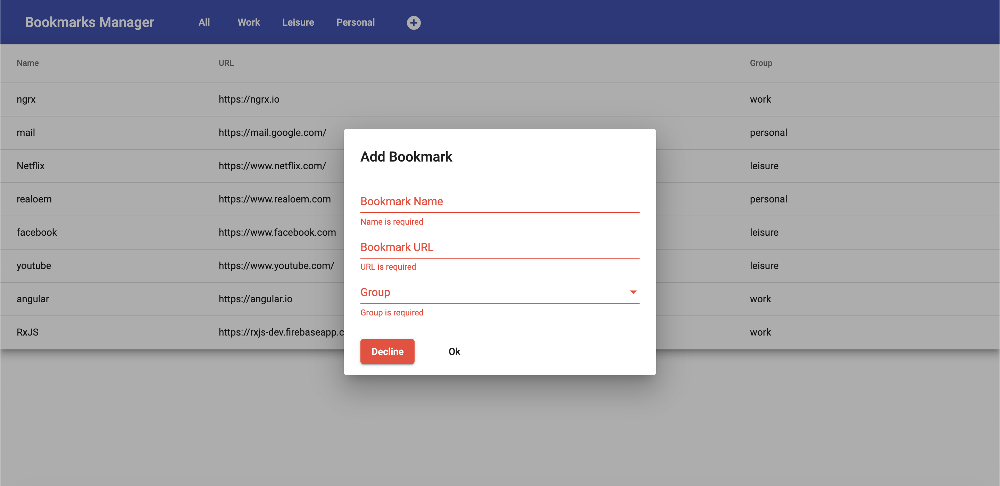
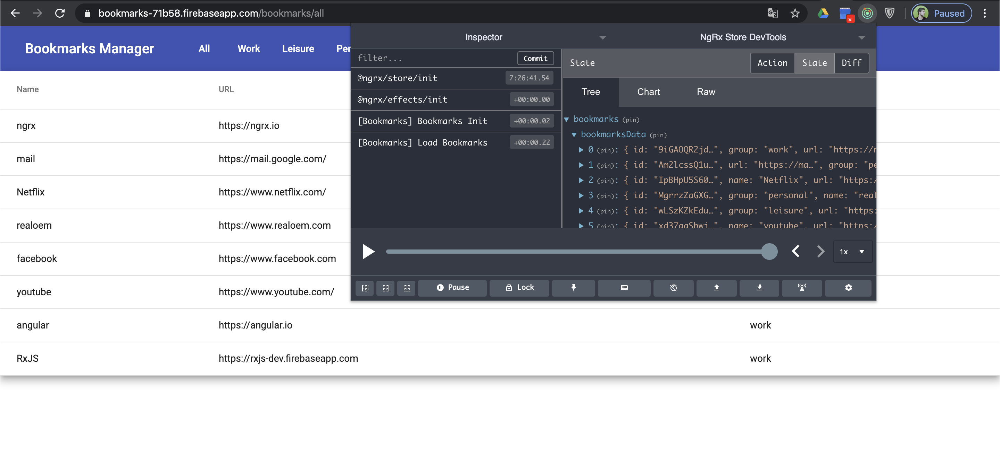
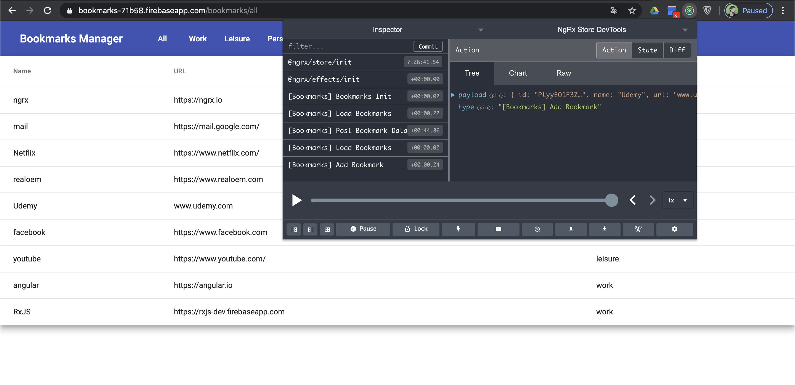
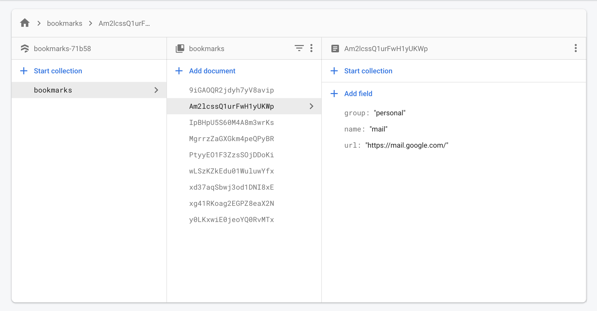

# Bookmark Manager Test App

This project was generated with [Angular CLI](https://github.com/angular/angular-cli) version 8.3.28.

## Development server

Use `npm i` to install dependencies. Run `ng serve` for a dev server. Navigate to `http://localhost:4200/`. The app will automatically reload if you change any of the source files.

## Build

Run `ng build` to build the project. The build artifacts will be stored in the `dist/` directory. Use the `--prod` flag for a production build.

## Documentation

### Navigation

Build app locally or use prod [link](https://bookmarks-71b58.web.app)

App starts and redirects to ungrouped bookmarks page

Use menu in header for navigation

Hover on table row to access edit and delete controls

Click edit to see modal window with edit options

Click delete to see delete modal and delete/cancel 

Use plus button in header to get access to bookmark creation

Enter valid name, url and make selection of group option to save new bookmark

### Store

@ngrx/store-devtools installed for project

Install Chrome extention if needed 

[Redux Devtools for Chrome](https://chrome.google.com/webstore/detail/redux-devtools/lmhkpmbekcpmknklioeibfkpmmfibljd?hl=en)

Open extension to debug state

Do something to change app state and check actions

### Firebase

All data stored and retrieved from firebase

